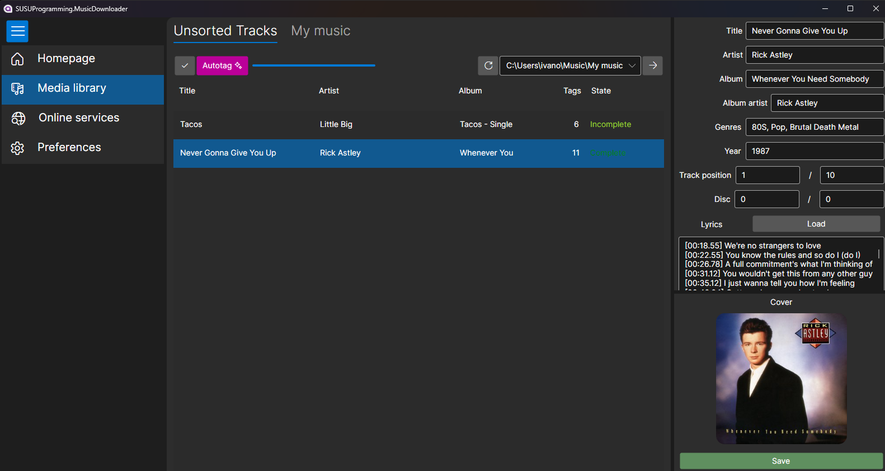
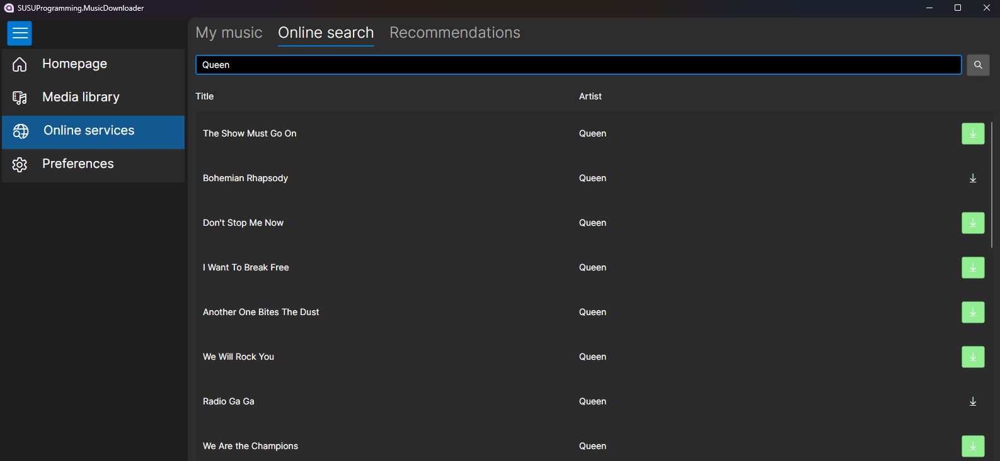

# MusicDownloader

 

## Description
MusicDownloader is a desktop application designed to help users organize their local media library. It allows users to edit track metadata, group tracks, and download them from VK Music. The application simplifies library management by visualizing data about track tag coverage, indicating when tracks require additional tags, and scanning specified locations for all tracks. It can also automatically tag tracks based on online sources such as LastFM and Genius.

## Screenshots
Here are some screenshots of the application:

*Local Library Interface*

*Online Service Interface*

## Installation Instructions
1. Download the installer for your platform from the [latest releases page](https://github.com/IOExcept10n/MusicDownloader/releases/latest).
2. Follow the installation steps provided in the installer.
3. Once the app is installed, you can use offline services without registration.

### Logging into VK ID
To access online track services:
1. Open the online service page within the app.
2. Log in using your VK ID credentials (username and password).
3. If sent, input the 2FA code.
4. If the data is filled in correctly, the app will log you into your account, providing access to your saved tracks and the ability to download them.

## Usage
The application consists of two main pages: **Local Library** and **Online Service**.

### Local Library
- Use the editor for selected tracks to add and edit tags.
- Utilize the auto tagger to search for tags for selected tracks.
- Play tracks in your default media player by double-clicking.
- Move tracks between directories as needed.

### Online Service
- View a list of your favorite tracks.
- Perform online searches by query.
- Receive recommendations from the presented service.

## Contributing
Users are encouraged to leave issues for bug reports, feature requests, and any other messages. Pull requests are welcome and will be reviewed when time permits.

*Also you can help with app translation by creating pull requests with localized resources!*

## License
This project is licensed under the MIT License. **However, please note that it was created for educational purposes and is not recommended for commercial use.**

## Contact Information
You can reach me via:
- Telegram: [t.me/ioexcept10n](https://t.me/ioexcept10n)
- Email: [ioexcept10n@outlook.com](mailto:ioexcept10n@outlook.com)
